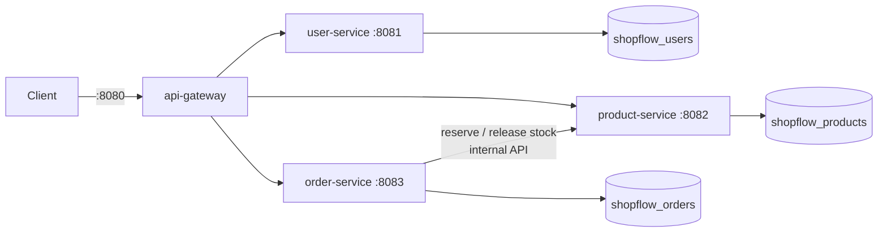
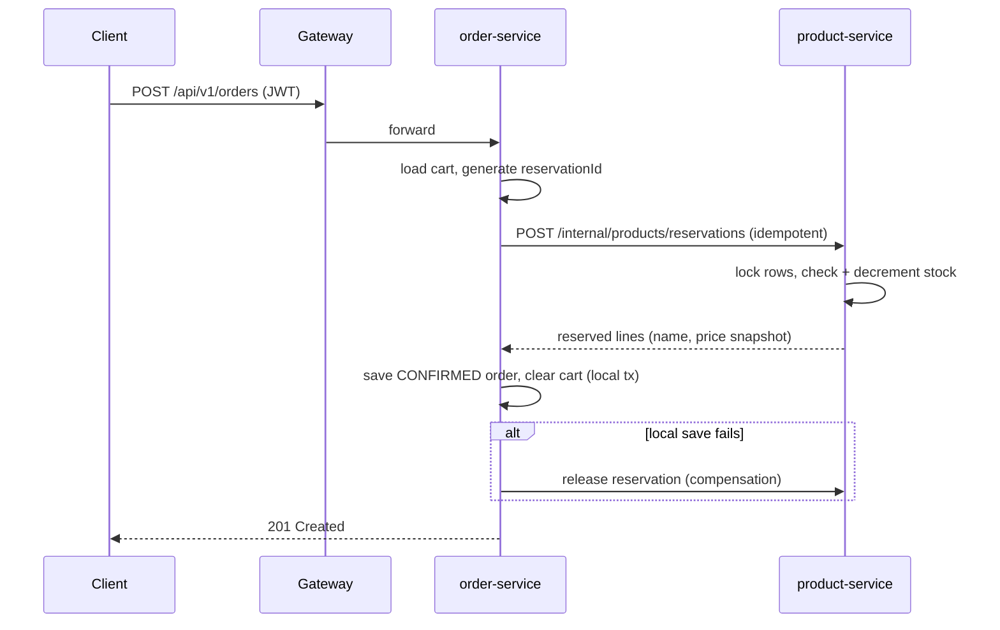

# ShopFlow

A cloud-native e-commerce and order processing platform, built progressively from a
well-structured monolith into event-driven microservices.

> **Current status: Phase 2 — microservices.** An API gateway in front of three Spring Boot
> services (users, products, orders), each with its own PostgreSQL database. Checkout uses
> idempotent stock reservations with retries and compensation instead of a single
> transaction. The Phase 1 monolith remains in `backend/` for reference.

## Tech stack

| Area | Choice |
|---|---|
| Language / runtime | Java 21 (LTS) |
| Services | Spring Boot 3.5 (Web, Data JPA, Security, Validation, Actuator) |
| Gateway | Spring Cloud Gateway 2025.0 (reactive) |
| Service-to-service | Spring `RestClient` with timeouts, retries, idempotency keys |
| Database | PostgreSQL 16, one database per service, Flyway migrations |
| Auth | JWT (jjwt 0.12), BCrypt, RBAC (USER / SELLER / ADMIN) |
| API docs | springdoc-openapi (Swagger UI per service) |
| Tests | JUnit 5, Mockito, AssertJ |

## Architecture



### Checkout flow


## Getting started

### Prerequisites
Java 21 JDK, Maven 3.9+, PostgreSQL 16 (Homebrew or Docker), Git, `openssl`.

### Setup (once)
```bash
cp .env.example .env
# Fill in DB_PASSWORD, ADMIN_PASSWORD, and:
openssl rand -base64 32      # -> JWT_SECRET
openssl rand -hex 32         # -> INTERNAL_API_KEY
./scripts/create-databases.sh        # Homebrew PostgreSQL
# or: docker compose up -d           # Docker PostgreSQL (creates the databases)
```

### Run
```bash
./scripts/run-local.sh       # build + start all services
./scripts/smoke-test.sh      # end-to-end test through the gateway
./scripts/stop-local.sh
```
Swagger UIs: http://localhost:8081/swagger-ui.html (users), :8082 (products), :8083 (orders).

### Tests
```bash
cd services && mvn test
```

## API overview

All public endpoints are served through the gateway at `http://localhost:8080`.

| Method | Path | Access |
|---|---|---|
| POST | `/api/v1/auth/register` | Public |
| POST | `/api/v1/auth/login` | Public |
| GET | `/api/v1/users/me` | Authenticated |
| GET | `/api/v1/products` (search, filter, paginate, sort) | Public |
| GET | `/api/v1/products/{id}` | Public |
| POST | `/api/v1/products` | SELLER, ADMIN |
| PUT / DELETE | `/api/v1/products/{id}` | Owning SELLER, ADMIN |
| GET / DELETE | `/api/v1/cart` | Authenticated |
| POST | `/api/v1/cart/items` | Authenticated |
| PATCH / DELETE | `/api/v1/cart/items/{productId}` | Authenticated |
| POST | `/api/v1/orders` (checkout from cart) | Authenticated |
| GET | `/api/v1/orders`, `/api/v1/orders/{id}` | Owner (ADMIN sees all) |
| POST | `/api/v1/orders/{id}/cancel` | Owner, ADMIN |
| GET | `/api/v1/admin/orders` | ADMIN |
| PATCH | `/api/v1/admin/orders/{id}/status` | ADMIN |

All errors use one JSON shape:
```json
{ "timestamp": "...", "status": 409, "error": "Conflict",
  "message": "Insufficient stock for 'Keyboard': requested 3, available 1",
  "path": "/api/v1/orders" }
```

## Documentation
- [Phase 1 guide: concepts, walkthrough, testing, troubleshooting, interview questions](docs/PHASE-1-GUIDE.md)
- [Phase 2 guide: microservices, idempotency, sagas, experiments, interview questions](docs/PHASE-2-GUIDE.md)
- [ADR 0001: Start with a modular monolith](docs/adr/0001-modular-monolith-first.md)
- [ADR 0002: Sync REST with idempotent reservations](docs/adr/0002-sync-rest-with-idempotent-reservations.md)

## Roadmap
- [x] Phase 1 — Modular monolith REST API
- [x] Phase 2 — Microservices + API Gateway
- [ ] Phase 3 — Redis caching and rate limiting
- [ ] Phase 4 — Kafka event-driven order processing
- [ ] Phase 5 — Docker and Docker Compose for all services
- [ ] Phase 6 — Integration testing with Testcontainers
- [ ] Phase 7 — GitHub Actions CI/CD
- [ ] Phase 8 — Kubernetes
- [ ] Phase 9 — Terraform
- [ ] Phase 10 — Prometheus, Grafana, load testing
- [ ] Phase 11 — Optional AWS deployment (free-tier only)
