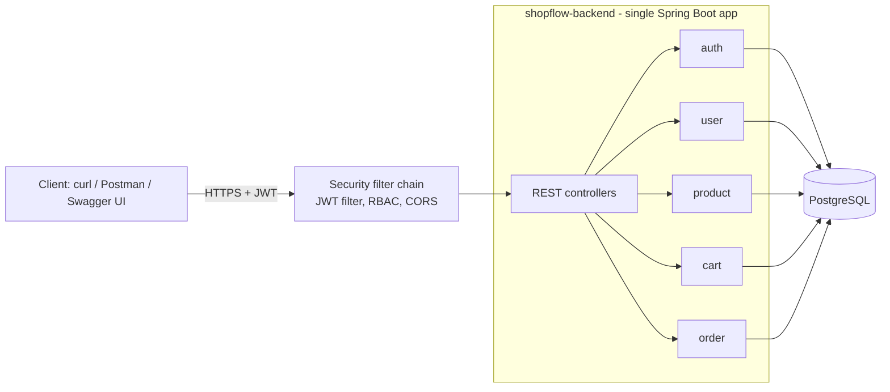
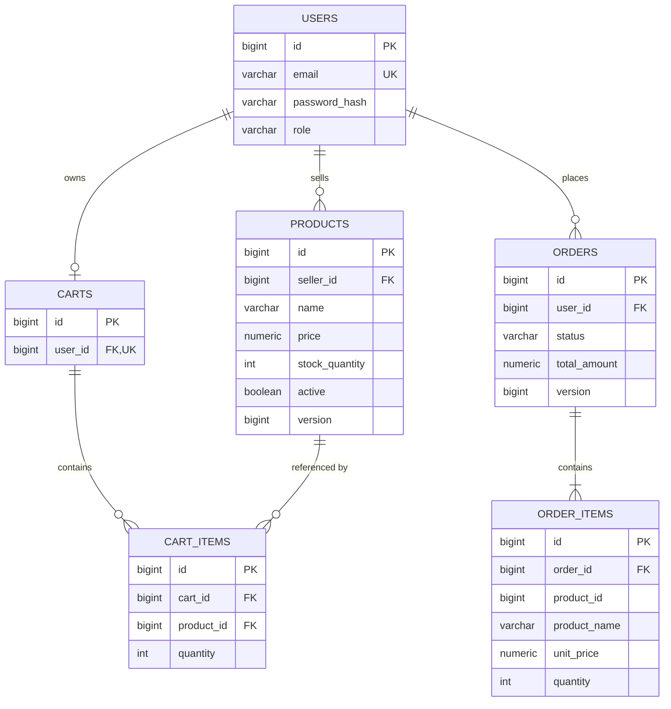

# ShopFlow

A cloud-native e-commerce and order processing platform, built progressively from a
well-structured monolith into event-driven microservices.

> **Current status: Phase 1 — modular monolith.** Spring Boot REST API with JWT auth,
> role-based access control (USER / SELLER / ADMIN), PostgreSQL with Flyway migrations,
> concurrency-safe checkout, pagination, validation and OpenAPI docs.

## Tech stack (Phase 1)

| Area | Choice |
|---|---|
| Language / runtime | Java 21 (LTS) |
| Framework | Spring Boot 3.5 (Web, Data JPA, Security, Validation, Actuator) |
| Database | PostgreSQL 16, Flyway migrations |
| Auth | JWT (jjwt 0.12), BCrypt password hashing |
| API docs | springdoc-openapi (Swagger UI) |
| Tests | JUnit 5, Mockito, AssertJ |

## Architecture (Phase 1)



Each feature package (`auth`, `user`, `product`, `cart`, `order`) owns its entities,
repository, service, controller and DTOs. Modules reference each other by **id**, not by
JPA relationships, so they can be split into separate services in Phase 2.

## Database schema



## Getting started

### Prerequisites
Java 21 JDK, Maven 3.9+, Docker (for PostgreSQL), Git, and optionally `openssl`.

### 1. Configure environment
```bash
cp .env.example .env
openssl rand -base64 32        # paste the output as JWT_SECRET in .env
# also set DB_PASSWORD and ADMIN_PASSWORD (12+ characters) in .env
```

### 2. Start PostgreSQL
```bash
docker compose up -d
docker compose ps              # wait until postgres shows "healthy"
```

### 3. Run the API
```bash
cd backend
mvn spring-boot:run
```
- Swagger UI: http://localhost:8080/swagger-ui.html
- Health:     http://localhost:8080/actuator/health

### 4. Run tests
```bash
cd backend
mvn test
```

## API overview

| Method | Path | Access |
|---|---|---|
| POST | `/api/v1/auth/register` | Public |
| POST | `/api/v1/auth/login` | Public |
| GET | `/api/v1/users/me` | Authenticated |
| GET | `/api/v1/products` (search, filter, paginate, sort) | Public |
| GET | `/api/v1/products/{id}` | Public |
| POST | `/api/v1/products` | SELLER, ADMIN |
| PUT / DELETE | `/api/v1/products/{id}` | Owning SELLER, ADMIN |
| GET / DELETE | `/api/v1/cart` | Authenticated |
| POST | `/api/v1/cart/items` | Authenticated |
| PATCH / DELETE | `/api/v1/cart/items/{productId}` | Authenticated |
| POST | `/api/v1/orders` (checkout from cart) | Authenticated |
| GET | `/api/v1/orders`, `/api/v1/orders/{id}` | Owner (ADMIN sees all) |
| POST | `/api/v1/orders/{id}/cancel` | Owner, ADMIN |
| GET | `/api/v1/admin/orders` | ADMIN |
| PATCH | `/api/v1/admin/orders/{id}/status` | ADMIN |

All errors use one JSON shape:
```json
{ "timestamp": "...", "status": 409, "error": "Conflict",
  "message": "Insufficient stock for 'Keyboard': requested 3, available 1",
  "path": "/api/v1/orders" }
```

## Documentation
- [Phase 1 guide: concepts, walkthrough, testing, troubleshooting, interview questions](docs/PHASE-1-GUIDE.md)
- [ADR 0001: Start with a modular monolith](docs/adr/0001-modular-monolith-first.md)

## Roadmap
- [x] Phase 1 — Modular monolith REST API
- [ ] Phase 2 — Microservices + API Gateway
- [ ] Phase 3 — Redis caching and rate limiting
- [ ] Phase 4 — Kafka event-driven order processing
- [ ] Phase 5 — Docker and Docker Compose for all services
- [ ] Phase 6 — Integration testing with Testcontainers
- [ ] Phase 7 — GitHub Actions CI/CD
- [ ] Phase 8 — Kubernetes
- [ ] Phase 9 — Terraform
- [ ] Phase 10 — Prometheus, Grafana, load testing
- [ ] Phase 11 — Optional AWS deployment (free-tier only)
