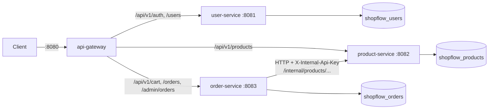

# Phase 2 Guide: From Monolith to Microservices

## 1. What we built
The Phase 1 app is now four independently running programs plus a shared library:

| Program | Port | Owns | Database |
|---|---|---|---|
| api-gateway | 8080 | Routing, CORS, timeouts. The only public entry point | none |
| user-service | 8081 | Registration, login, JWT issuing, admin bootstrap | `shopflow_users` |
| product-service | 8082 | Catalog, stock, stock reservations | `shopflow_products` |
| order-service | 8083 | Carts, orders, checkout orchestration | `shopflow_orders` |
| common (library) | n/a | JWT verification, security defaults, error format, pagination | n/a |



## 2. Why
- **Independent deployment and scaling:** product browsing can be scaled without
  scaling login.
- **Fault isolation:** a bug in order-service can't crash the catalog.
- **Team ownership:** each service could be owned by a different team.
- **The cost:** network calls fail, data is split across databases, and you lose
  single-transaction consistency. Most of this phase is about handling that cost.

## 3. Concepts

**Database per service.** A service's tables are private. Other services ask through its
API, never by querying its database. That's why foreign keys to users/products were
removed: `products.seller_id`, `carts.user_id` and `cart_items.product_id` are now plain ids.

**API gateway.** One public address. Clients don't need to know where services run, and
cross-cutting concerns (CORS now, rate limiting in Phase 3) live in one place.

**Stateless JWT across services.** user-service signs tokens; every other service verifies
them with the shared secret, without calling user-service. If user-service goes down,
logged-in users can still browse and order.

**Timeouts.** Every remote call has a connect timeout (2s) and a read timeout (5s). Without
them, one slow service makes its callers slow, and failures cascade through the system.

**The ambiguity problem.** If a call times out, you don't know whether the other side did
the work. You must design for "maybe".

**Idempotency.** An operation is idempotent if doing it twice equals doing it once.
`reserve(reservationId)` and `release(reservationId)` are idempotent because the caller
supplies the id. That makes retries and "just in case" releases safe.

**Saga / compensation.** Instead of one transaction across services, do a sequence of local
steps and undo earlier steps if a later one fails. Checkout: reserve stock (remote), then
save order (local); if saving fails, release stock.

**Don't hold a DB transaction across a network call.** It pins a pooled DB connection for
as long as the remote service takes. `CartService` and `OrderService` use short
`TransactionTemplate` blocks around DB work only.

## 4. Key code to read (in this order)
1. `order-service/.../order/OrderService.java`: `placeOrder`, `reserveWithRetry`, `cancelOrder`
2. `product-service/.../inventory/InventoryService.java`: `reserve`, `release`, `claim`
3. `product-service/.../inventory/StockReservationRepository.java`: the upsert + lock
4. `order-service/.../catalog/ProductClient.java`: HTTP errors to domain exceptions
5. `api-gateway/.../GatewayRoutesConfig.java`: routing table
6. `common/.../security/SecurityDefaults.java`: shared security setup

## 5. Run it

One-time setup:
```bash
cd ~/projects/shopflow
echo "INTERNAL_API_KEY=$(openssl rand -hex 32)" >> .env
./scripts/create-databases.sh
```

Every time:
```bash
./scripts/run-local.sh       # builds + starts all 4, waits until healthy
./scripts/smoke-test.sh      # end-to-end check through the gateway
./scripts/stop-local.sh      # stops everything
```

Unit tests (all modules):
```bash
cd services
mvn test
```

## 6. Experiments that teach distributed systems
Try these and watch `logs/order-service.log` and `logs/product-service.log`:

1. **Downstream failure.** Stop product-service only:
   `kill $(cat .pids/product-service.pid)`. Now place an order. You get **503** after
   3 attempts; the log shows `Reserve attempt 1 failed ... retrying` and a final release.
   Product browsing fails too, but login (user-service) still works: fault isolation.
   Restart everything with `./scripts/stop-local.sh && ./scripts/run-local.sh`.
2. **Internal endpoint protection.** `curl -i "localhost:8082/internal/products?ids=1"`
   returns 401 (no key). Through the gateway (`localhost:8080/internal/...`) it's 404.
3. **Idempotent replay.** Call reserve twice directly with the same id and the key from
   `.env`. The second call returns the same reservation and stock drops only once.

## 7. Common errors

| Symptom | Fix |
|---|---|
| `INTERNAL_API_KEY must be set` at startup | Add it to `.env` (see section 5) |
| `port 8080 is already in use` | Stop the Phase 1 app (Ctrl+C in its tab) or run `./scripts/stop-local.sh` |
| `database "shopflow_products" does not exist` | Run `./scripts/create-databases.sh` |
| `permission denied: ./scripts/run-local.sh` | `chmod +x scripts/*.sh` |
| A service "DID NOT START" | `tail -50 logs/<service>.log` and read the last `Caused by:` line |
| Gateway returns 503/504 for a route | That service is down or slow; check its log |
| Order fails with 503 | product-service unreachable; check `logs/product-service.log` |
| Maven can't resolve `spring-cloud-starter-gateway-server-webflux` | Send me the error; the Spring Cloud artifact naming changed in 2025 releases and may need adjusting |

## 8. Interview questions on Phase 2
1. Why split into these four services? What would you NOT split, and why?
2. What is the database-per-service pattern? How do you join data across services?
3. Why did checkout get harder after the split? *(Lost single ACID transaction.)*
4. What is a Saga? Orchestration vs choreography? *(We use orchestration; Phase 4 moves toward choreography with events.)*
5. Why not use two-phase commit?
6. What is idempotency, and why does it make retries safe? Which HTTP methods are idempotent by definition?
7. A reserve call times out. Did it succeed? What does your system do? *(Unknown; retry with the same id, then release as compensation; tombstone handles a late-arriving reserve.)*
8. When should you NOT retry? *(Definite business failures like 409; non-idempotent operations.)*
9. What is a cascading failure, and how do timeouts help? What's a circuit breaker? *(Coming in Phase 3/4 with Resilience4j.)*
10. Why must you not hold a database transaction open during an HTTP call?
11. How do services trust a JWT without calling user-service? What's the downside of a shared HS256 secret vs RS256?
12. How are internal endpoints protected? What would you use in production? *(mTLS, service mesh, network policies.)*
13. Where does CORS belong in a gateway architecture, and why only there?
14. What remaining failure can still leave stock reserved without an order? How would you fix it? *(Compensation failure: outbox pattern plus a reconciliation job; Phase 4.)*
15. Why is a shared `common` library a trade-off? *(Convenience vs coupling; must be versioned carefully.)*

## 9. Done checklist
- [ ] `cd services && mvn test` passes
- [ ] `./scripts/run-local.sh` shows all 4 services UP
- [ ] `./scripts/smoke-test.sh` prints ALL CHECKS PASSED
- [ ] Experiment 1 (stop product-service) behaves as described
- [ ] Committed and pushed to GitHub
