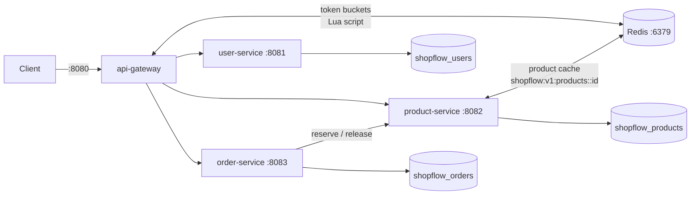
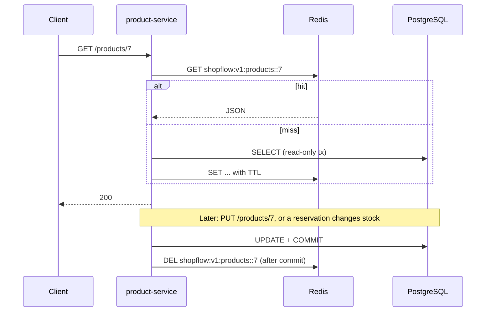

# Phase 3 Guide: Redis Caching and Gateway Rate Limiting

## 1. What we built

Redis now plays two roles. It is a **read cache** for product-service and the **shared
counter store** for the API gateway's rate limiter. PostgreSQL is still the only source of
truth: if Redis disappears, nothing is lost and requests keep working.

| Where | What changed |
|---|---|
| product-service | `GET /api/v1/products/{id}` is cached in Redis (cache-aside, JSON, 10 min TTL). Updates, deletes, stock reservations and releases evict the entry **after the DB commit**. A Redis outage falls back to PostgreSQL. |
| api-gateway | Every route uses Spring Cloud Gateway's `RequestRateLimiter` with Redis token buckets. Login/register: per IP, bursts of 10 then 10/min. Everything else: per verified user (or per IP when anonymous), bursts of 20 then 10/s. Rejections are `429` with the standard JSON error body and `X-RateLimit-*` headers. |
| scripts | `run-local.sh` refuses to start without Redis. `smoke-test.sh` checks caching, eviction and a real 429. |



### Read and invalidation flow



## 2. Why

**Caching.** In a shop, product pages are read far more often than they change. Serving a
hot product from memory skips a database query and frees PostgreSQL connections for the
work that must hit the database (checkout, reservations). We'll measure the real effect
with k6 in Phase 10. Until then, we claim no numbers.

**Rate limiting.** It protects login from password guessing and credential stuffing, stops
one buggy or abusive client from starving everyone else, and gives clients a clear signal
(`429` plus headers) instead of a slow, overloaded system. Doing it at the gateway means
one implementation, applied before any service spends work on the request.

## 3. Concepts

### Caching

**Cache-aside (lazy loading).** The application checks the cache, and on a miss loads from
the database and stores the result. The cache never talks to the database itself. Spring's
`@Cacheable` implements exactly this.

**Invalidate, don't update.** On writes we *delete* the cached entry rather than writing the
new value into it. The next read repopulates it from the database. This is simpler and avoids
caching a value built before the transaction finished. For example, `updatedAt` is only set
when Hibernate flushes.

**Evict after commit.** If we evicted inside the transaction, a concurrent reader could miss,
read the **old** row (the change isn't committed yet) and put it back into the cache. So
writes publish a `ProductsChangedEvent`, and `ProductCacheInvalidator` evicts in
`@TransactionalEventListener(phase = AFTER_COMMIT)`. If the transaction rolls back, nothing is
evicted, because nothing changed.

**The race that remains.** A reader can still load the old row just before the commit and
write it to the cache just after the eviction. It's rare, and the **TTL** bounds how long such a
stale entry can live (10 minutes here, configurable via `PRODUCT_CACHE_TTL`). Stronger fixes
include delayed double-delete, versioned values, or change-data-capture driven eviction.
Mentioning these in an interview shows you know cache-aside isn't perfectly consistent.

**Correctness never depends on the cache.** The cache only serves the public product view.
Stock checks and reservations (`/internal/products/**`) always read and lock real database
rows. A stale cached price can't be charged, because order lines use the price captured
inside the reservation transaction.

**What we don't cache, and why.** Search results (`GET /products?...`): every combination of
filters, sort and page would be a separate entry, and one product change would have to evict
all of them. Low hit rate, hard invalidation. A single-product read is the hot, cleanly
invalidated path.

**Cache hits skip the transaction.** `@EnableCaching(order = LOWEST_PRECEDENCE - 1)` puts the
cache check *outside* `@Transactional`. A hit never borrows a database connection, and
`ProductCachingTest` proves it.

**Serialization.** Values are stored as JSON typed to `ProductResponse`, not Java
serialization. That makes them readable in `redis-cli`, free of Java class names, and immune to
the deserialization attacks Java serialization is known for. Keys are versioned:
`shopflow:v1:products::7`. If the DTO changes incompatibly, bump `v1` to `v2` and old
entries are ignored until they expire.

**Fail open.** `FailOpenCacheErrorHandler` turns cache errors into cache misses, logged as
warnings. Redis timeouts are 500 ms instead of Lettuce's default 60 s, so an outage makes
requests a bit slower instead of hanging them. For the same reason the Redis **health
indicator is disabled** in both services. A dependency you can live without must not mark you
DOWN, or Kubernetes would restart healthy pods because the cache had a hiccup.

**Classic cache failure modes** (good interview vocabulary; not all handled yet):

- *Stampede (thundering herd).* A hot key expires and many requests rebuild it at once.
  Fixes: `@Cacheable(sync = true)` (per JVM), a distributed lock, or early refresh.
- *Penetration.* Repeated requests for ids that don't exist always miss. We don't cache
  404s. Fixes: cache "not found" briefly, or use a Bloom filter. Rate limiting also helps.
- *Avalanche.* Many keys expire at the same moment. Fix: add random jitter to TTLs.

### Rate limiting

**Algorithms.**

- *Fixed window* (N per minute) is simple, but allows 2N across a window boundary.
- *Sliding window* is smoother but costs more memory or work.
- *Leaky bucket* gives a constant output rate.
- *Token bucket* (what we use) holds up to `burstCapacity` tokens and refills
  `replenishRate` tokens per second. Each request costs `requestedTokens`. It allows short
  bursts while enforcing an average rate.

**Our settings** (see `api-gateway/src/main/resources/application.yml`):

| Limiter | Key | Settings | Effect |
|---|---|---|---|
| auth | client IP | rate 1, burst 60, cost 6 | bursts of 10 requests, then 1 every 6 s (10/min) |
| api | verified user id, else IP | rate 10, burst 20, cost 1 | bursts of 20, then 10/s |

The "cost 6" trick is how Spring Cloud Gateway does limits slower than 1 request/second.

**Why Redis and not memory?** With two gateway instances, in-memory counters would give every
client double the limit. Redis holds one shared bucket per client. `RedisRateLimiter` runs a
**Lua script** inside Redis, so "read tokens, refill, take, save" is one atomic step even under
concurrency.

**Who is "the client"?** `ClientKeyResolver` builds keys like `api:user:42` or
`auth:ip:203.0.113.7`. Two details matter:

- The JWT's **signature is verified** (`JwtSubjectExtractor`) before its user id is
  trusted. A JWT payload is just Base64. If we read it unverified, an attacker could
  invent a new user id per request and never be limited.
- The IP is taken from the **TCP connection**, not from `X-Forwarded-For`, which the client
  can set to anything. Behind a real load balancer (Phase 8/11) we'd use
  `XForwardedRemoteAddressResolver` configured to trust only our own proxy.

**Fail open vs fail closed.** If Redis is down, `RedisRateLimiter` lets requests through
(`X-RateLimit-Remaining: -1`). We choose availability over protection here and document it.
A bank might choose fail-closed for login.

**Limits of IP-based limiting.** Many users behind one NAT or office share an IP. A
distributed attack uses thousands of IPs. Real systems layer this with per-account lockout,
CAPTCHA, and WAF/CDN protections.

**Why a custom `RateLimitErrorResponseFilter`?** The built-in filter returns `429` with an
empty body. Ours wraps the response so a `429` gets the same JSON error shape as every other
error in ShopFlow.

## 4. Key code to read (in this order)

1. `product-service/.../product/ProductService.java`: `@Cacheable` on `getById`, events on update/delete
2. `product-service/.../product/ProductCacheInvalidator.java`: after-commit eviction
3. `product-service/.../config/CacheConfig.java` and `RedisCacheConfig.java`: ordering, error handler, JSON, TTL, key prefix
4. `product-service/.../inventory/InventoryService.java`: events when stock changes
5. `api-gateway/.../GatewayRoutesConfig.java`: which limiter applies to which route
6. `api-gateway/.../ratelimit/RateLimitConfig.java`, `ClientKeyResolver.java`, `JwtSubjectExtractor.java`
7. `product-service/src/test/.../ProductCachingTest.java`: how the behaviour is proven without Redis

## 5. Run it

One-time: Redis must be installed and running. You already did this:

```bash
brew services start redis
redis-cli ping          # -> PONG
```

Every time:

```bash
cd ~/projects/shopflow
./scripts/run-local.sh       # now also checks Redis
./scripts/smoke-test.sh      # now also checks cache + rate limiting
./scripts/stop-local.sh
```

## 6. Test it

```bash
cd ~/projects/shopflow/services
mvn test
```

New tests:

| Test | Proves |
|---|---|
| `ProductCachingTest` | 2nd read comes from cache **without opening a transaction**; update/delete/stock change evict **only after commit**; rollback doesn't evict; 404s aren't cached |
| `ProductCacheFailOpenTest` | reads still work when every cache call throws |
| `ProductCacheInvalidatorTest` | eviction errors never fail the (already committed) request |
| `RedisCacheConfigTest` | JSON format, no class names, tolerant of old fields, `shopflow:v1:products::` keys |
| `ProductServiceTest`, `InventoryServiceTest` | which writes publish change events (and which don't) |
| `JwtSubjectExtractorTest` | forged, expired, wrong-issuer and garbage tokens are ignored |
| `ClientKeyResolverTest` | user vs IP keys; forged tokens and `X-Forwarded-For` can't buy a fresh bucket |
| `RateLimitErrorResponseFilterTest` | 429 gets the JSON error body; other responses untouched |

## 7. Experiments

Open a second Terminal tab for `redis-cli`.

1. **Watch the cache work.** Run `redis-cli monitor`. In the first tab, request a product
   twice:
   `curl -s localhost:8080/api/v1/products/1 > /dev/null` (use an id that exists).
   The first request shows a `GET` then a `SET` with an expiry. The second shows only a
   `GET`, which was a hit. Ctrl+C stops `monitor`. See the stored JSON with
   `redis-cli get shopflow:v1:products::1` and its remaining life with
   `redis-cli ttl shopflow:v1:products::1`.
2. **Watch invalidation.** Keep `monitor` running and run `./scripts/smoke-test.sh`. Each
   update, reservation and cancel is followed by a `DEL` of that product's key.
3. **Redis outage.** With everything running, `brew services stop redis`. Then:
   - `curl -i localhost:8080/api/v1/products/1` still returns 200 from PostgreSQL. It's a bit
     slower, because each cache call waits for its 500 ms timeout.
   - `tail -5 logs/product-service.log` shows `Cache GET failed ... Falling back to the database`.
   - The response header shows `X-RateLimit-Remaining: -1`: the limiter failed open.

   Restore with `brew services start redis`. Lettuce reconnects by itself.
4. **Brute-force protection.** Fire 12 failed logins in a row:
   ```bash
   for i in $(seq 1 12); do curl -s -o /dev/null -w "%{http_code} " -X POST localhost:8080/api/v1/auth/login -H "Content-Type: application/json" -d '{"email":"nobody@test.com","password":"wrong-password"}'; done; echo
   ```
   You'll see `401`s, then `429`s once the auth bucket is empty. It holds 10, minus anything
   the smoke test just used. Wait a minute and it refills.
5. **See the buckets.** `redis-cli --scan --pattern 'request_rate_limiter*'` lists the
   token-bucket keys. Each client key (`api:user:<id>`, `auth:ip:<ip>`) has a `tokens` and a
   `timestamp` entry. Depending on the Spring Cloud Gateway version the key may also contain
   the route id, which would make budgets per route instead of shared across routes. This
   command shows you which one you have.

## 8. Common errors

| Symptom | Fix |
|---|---|
| `run-local.sh`: `Redis is not answering` | `brew services start redis`, then `redis-cli ping` |
| Gateway log: `JWT_SECRET environment variable must be set` | The gateway now needs `JWT_SECRET` too; it reads the same `.env` |
| Gateway log: `RedisRateLimiter is not initialized` | A `RedisRateLimiter` was created with `new` outside a `@Bean`. Keep them in `RateLimitConfig` |
| Gateway log: `NoUniqueBeanDefinitionException` for `RateLimiter`/`KeyResolver` | One of each must be `@Primary` (already done in `RateLimitConfig`) |
| Smoke test: `product read was cached` FAIL | Check `tail -50 logs/product-service.log` for Redis connection errors |
| Smoke test: `429` on register | You ran it more than ~5 times in a minute. Wait 60 s. That's the limiter working |
| Smoke test: `X-RateLimit-Remaining: -1` FAIL | The gateway can't reach Redis (limiter failing open). Start Redis, restart services |
| Every request slow by ~0.5-1 s | Redis is down or unreachable; see the logs for `Cache GET failed` |
| Maven can't download `spring-boot-starter-data-redis*` | Check your internet connection; versions come from the Spring Boot parent, so don't add version numbers |

## 9. Interview questions on Phase 3

1. Explain cache-aside. What other caching patterns exist (read-through, write-through,
   write-behind), and when would you use them?
2. Why do you evict on write instead of updating the cache?
3. Why evict **after commit**? Walk through the race if you evict before commit.
4. Is your cache strongly consistent with the database? What's the worst case, and what
   bounds it? *(No. A rare race can cache a stale value; the TTL bounds it.)*
5. How do you choose a TTL? What happens if it's too short or too long?
6. Why didn't you cache product search results?
7. What happens when Redis goes down? Why did you disable the Redis health check?
8. Why JSON instead of Java serialization in Redis? Why version the key prefix?
9. What are cache stampede, penetration and avalanche, and how would you mitigate each?
10. Local cache (Caffeine) vs distributed cache (Redis): trade-offs? When would you use both
    (two-level cache)?
11. Why does a cache hit skip the database transaction here, and why does that matter?
12. Compare fixed window, sliding window, token bucket and leaky bucket.
13. Why does rate limiting need shared state (Redis) once you run more than one gateway?
    Why is the Lua script important?
14. What key do you rate-limit on? Why verify the JWT? Why not trust `X-Forwarded-For`?
15. Fail open or fail closed when the limiter's store is down? Defend your choice.
16. How does a client know it's being rate-limited, and what should it do? *(429 plus
    `X-RateLimit-*` headers; back off, ideally with jitter. `Retry-After` would be a good
    addition.)*
17. IP-based limits hurt users behind a shared NAT and don't stop distributed attacks. What
    else would you add? *(Per-account lockout, CAPTCHA, WAF/CDN, anomaly detection.)*
18. Does the gateway rate limiter protect a service from overload? *(Partly. It limits
    request rate per client, not concurrency or total load. Services still need timeouts,
    bulkheads and circuit breakers.)*

## 10. Cost note

Everything runs locally on Homebrew Redis: ₹0. If we deploy in Phase 11, managed Redis
(e.g. AWS ElastiCache) can cost money depending on account age and free-tier terms. We'll
check the current free-tier rules then, before creating anything.

## 11. Done checklist

- [ ] `cd services && mvn test` passes
- [ ] `./scripts/run-local.sh` shows all 4 services UP
- [ ] `./scripts/smoke-test.sh` prints ALL CHECKS PASSED
- [ ] Experiment 1 shows a cache hit, experiment 3 shows fail-open
- [ ] Committed and pushed to GitHub
